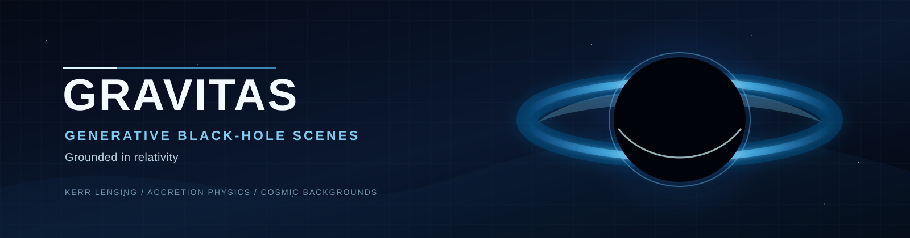

# Gravitas



**Generative black-hole scenes, grounded in relativity.**

Gravitas generates scientifically informed black-hole wallpapers for Douglas. It separates interactive visual exploration from research-grounded final rendering, preserving the difference between physical simulation and intentional artistic direction.

## Output formats

Every completed render exports both target monitor sizes:

| Format | Resolution | Aspect ratio |
|---|---:|---:|
| Super ultrawide | 5120×1440 | 32:9 |
| Ultrawide | 3440×1440 | 43:18 |

## Product architecture

```text
Web app (React + WebGPU preview)
        |
        v
Azure API / job queue
        |
        v
CPU render worker -> Blob Storage -> dual-size PNG + metadata
        |
        +-> Optional GPU reference-quality worker
```

- **Browser preview:** a fast WebGPU/WebGL approximation for immediate controls and composition.
- **Export worker:** deterministic CPU rendering for both required output sizes.
- **Reference-quality mode:** optional GPU-backed Kerr ray tracing and adaptive sampling.
- **Metadata:** every render records parameters, source background, algorithm version, preset, and physical/artistic choices.

## Server-rendered downloads

The browser canvas is strictly a fast preview. The download control posts every scene
control to `VITE_RENDER_API_URL/renders`, polls its UUID-backed job, and downloads both
PNGs through authenticated API proxy URLs. The Blob container remains private.

### Local development

```powershell
# API (in-memory job store, suitable for API development)
cd services/render-api
python -m uvicorn app.main:app --reload

# worker rasterizer tests
cd ../render-worker
python -m pytest

# web app
cd ../../apps/web
$env:VITE_RENDER_API_URL = 'http://localhost:8000'
npm run dev
```

`POST /renders` accepts the snake_case schema in
`packages/render-schema/render-request.schema.json`; `mass` defaults to `1.0`. The API
is the only field-of-view source and persists `field_of_view = 48 / zoom`; clients must
not send it. The response is `202 {"job_id": "<uuid>", "status": "queued"}`.
`GET /renders/{job_id}` returns the stage and, once complete, two API `output_urls`.
`GET /renders/{job_id}/files/{filename}` verifies that a completed job owns the
filename, then streams the private blob as an attachment.

### Azure Queue/Blob configuration

Set these variables on both deployed services:

| Variable | API | Worker | Purpose |
|---|:---:|:---:|---|
| `AZURE_STORAGE_CONNECTION_STRING` | yes | yes | Existing Storage account connection string |
| `RENDER_QUEUE_NAME` | yes | yes | Existing Azure Queue carrying UUID job IDs |
| `RENDER_BLOB_CONTAINER` | yes | yes | Existing private Blob container for job JSON, metadata, and PNGs |
| `RENDER_JOB_STORE=azure` | yes | no | Select the Azure Queue/Blob job-store adapter |
| `RENDER_PUBLIC_BASE_URL` | recommended | no | External API base URL used for proxy links (set behind Azure ingress) |
| `RENDER_OUTPUT_DIRECTORY` | no | optional | Worker scratch output path (default `/app/output`) |
| `VITE_RENDER_API_URL` | web build | no | Public API base URL, without `/renders` |

Build remotely from the repository root with Azure Container Registry, for example:

```powershell
az acr build --registry <registry> --image gravitas-api:latest --file services/render-api/Dockerfile .
az acr build --registry <registry> --image gravitas-worker:latest --file services/render-worker/Dockerfile .
```

The container and queue must already exist; this code does not provision Azure resources.
Do not enable anonymous Blob access or expose the storage connection string to the web
app. If `RENDER_PUBLIC_BASE_URL` is omitted, the API uses the request base URL; explicitly
set it to the external HTTPS API origin when ingress rewrites the internal host or path.

## Controls

Gravitas exposes spin, inclination, observer orbit, zoom, disk inner radius,
temperature, emissivity, thickness, flow direction, magnetic state, jet strength,
observing band, background, palette, and seed.

The blue palette requested for Douglas is a selectable color mapping. Physically derived blue coloration from temperature and redshift is recorded separately from artistic palette transforms.

## Documentation

- [Requirements](docs/requirements.md)
- [Research sources and validation](docs/research/sources.md)
- [Rendering algorithms](docs/algorithms/rendering.md)
- [Schwarzschild raster baseline](docs/algorithms/schwarzschild-baseline.md)
- [Azure implementation plan](docs/plans/2026-08-13-azure-web-app.md)
- [Feature priorities](docs/feature-priorities.md)
- [Rendering methods research](docs/research/rendering-methods.md)

## Scientific guardrails

- A broad bright EHT ring is not automatically a photon ring.
- Inclined disks should show Doppler-driven brightness asymmetry by default.
- Fast previews are labeled approximations; only the reference path is a general-relativistic ray-tracing model.
- Current server PNGs use a Schwarzschild far-field capture rasterizer with an
  approximate projected thin disk. Orbit rotates screen-space disk azimuth,
  retrograde flow flips the Doppler-beaming direction, blue spectrum is an artistic
  palette, and spin is only a Doppler-strength visual proxy—not Kerr physics.
- Background, disk thickness, jet strength, magnetic state, and observing band are
  retained in the metadata sidecar as provenance but do not alter server physics yet.
- NASA Webb/Hubble backgrounds retain source and crop provenance.
